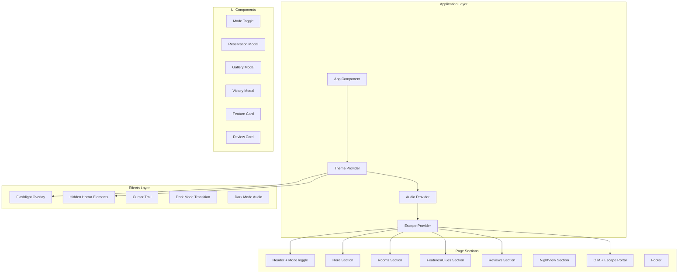

# SpookBnB Design Document

## Overview

SpookBnB is a Next.js frontend application presenting a dual-experience vacation rental landing page. The application transforms from a professional cabin rental site into an interactive horror escape room when Dark Mode is activated. The core innovation is the flashlight mechanic combined with a 4-fragment puzzle system that players must solve to "escape."

The application uses Tailwind CSS for styling, Framer Motion for animations, React Context for state management, and custom hooks for audio/sound effects.

## Architecture



## Component Hierarchy

```
app/
├── layout.js              # Root layout with providers
├── page.js                # Main page orchestrating all sections
├── globals.css            # Global styles and CSS variables

components/
├── providers/
│   ├── ThemeProvider.jsx  # Dark/Light mode state + localStorage
│   ├── AudioProvider.jsx  # Ambient audio management
│   └── EscapeProvider.jsx # Puzzle fragment completion state
│
├── layout/
│   ├── Header.jsx         # Navigation, mode toggle, scare effects
│   └── Footer.jsx         # Footer with modal triggers
│
├── sections/
│   ├── Hero.jsx           # Hero with dual content + exit scare
│   ├── Rooms.jsx          # 6 room cards + Fragment II puzzle
│   ├── Features.jsx       # Amenities / Cryptic clue cards
│   ├── Reviews.jsx        # Scrolling testimonials + Fragment I letters
│   ├── NightView.jsx      # Dark mode teaser (light mode only)
│   └── CTA.jsx            # Pricing + Fragment IV escape portal
│
├── ui/
│   ├── ModeToggle.jsx     # Sun/moon toggle button
│   ├── FeatureCard.jsx    # Individual feature/amenity card
│   ├── ReviewCard.jsx     # Review card with clue letters
│   ├── ReservationModal.jsx # Booking modal + Fragment III puzzle
│   ├── GalleryModal.jsx   # Image gallery modal
│   ├── VictoryModal.jsx   # Escape success celebration
│   └── FooterModals.jsx   # Footer link modals
│
├── effects/
│   ├── FlashlightOverlay.jsx  # Dark mode flashlight effect
│   ├── HiddenElements.jsx     # Horror icons, text, jumpscares
│   ├── CursorTrail.jsx        # Subtle cursor trail
│   ├── DarkModeTransition.jsx # Terrifying mode switch animation
│   ├── DarkModeAudio.jsx      # Ambient audio component
│   └── GhostText.jsx          # Ghostly text effects
│
└── hooks/
    ├── useMousePosition.js    # Mouse/touch tracking
    ├── useSoundEffects.js     # Sound effect playback
    └── useReservationPersistence.js # Modal state persistence
```

## Data Models

### Content Data (data/content.js)

```typescript
interface HeroContent {
  lightImage: string;
  darkImage: string;
  lightHeadline: string;
  darkHeadline: string;
  lightSubheadline: string;
  darkSubheadline: string;
}

interface Feature {
  id: string;
  icon: string;
  lightTitle: string;
  darkTitle: string;
  lightDescription: string;
  darkDescription: string;
  lightTag: string;
  darkTag: string;
}

interface DarkClue {
  id: number;
  riddleTitle: string;
  riddleText: string;
  hint: string;
  buttonText: string;
  icon: string;
}

interface Review {
  id: number;
  lightAuthor: string;
  darkAuthor: string;
  lightRating: number;
  darkRating: number;
  lightText: string;
  darkText: string;
  hasClue?: boolean;
  clueChar?: string;
}
```

### Escape System State

```typescript
interface EscapeContextType {
  fragment1Complete: boolean;  // LIGHT letters collected
  fragment2Complete: boolean;  // 7 eyes counted
  fragment3Complete: boolean;  // Contract deciphered
  fragment4Complete: boolean;  // Escape completed
  collectedLetters: string[];  // L, I, G, H, T
  completeFragment1: () => void;
  completeFragment2: (count: number) => void;
  completeFragment3: () => void;
  completeFragment4: () => void;
  collectLetter: (letter: string) => void;
}
```

## Puzzle System Design

### Fragment I: The Lost Souls
- Location: Reviews section
- Mechanic: 5 reviews have hidden clue letters (L-I-G-H-T)
- Solution: Click marked reviews to collect all 5 letters
- Visual: Letters appear in progress tracker in Features section

### Fragment II: The Watchers
- Location: Rooms section (Bathroom card)
- Mechanic: 7 hidden eyes appear on hover
- Solution: Count eyes and enter "7" in the input
- Visual: Eyes glow amber when found

### Fragment III: The Contract
- Location: Reservation Modal (dark mode)
- Mechanic: Glitching text reveals hidden message "STAY FOREVER"
- Solution: Click the stabilized text to acknowledge
- Visual: Text flickers between normal and corrupted states

### Fragment IV: The Escape
- Location: CTA section (appears when I-III complete)
- Mechanic: Golden portal appears with escape button
- Solution: Click to trigger escape sequence
- Visual: Multi-phase animation with light effects

## Audio System

### Sound Effects (useSoundEffects hook)
- `playJumpscare()` - Sudden scare sound
- `playGrowl()` - Menacing growl
- `playWhisper()` - Ghostly whisper
- `playCreak()` - Door creak
- `playClick()` - UI click
- `playBell()` - Success bell
- `playBuzz()` - Error buzz
- `playStatic()` - TV static

### Ambient Audio (AudioProvider)
- Continuous horror drone in dark mode
- Fades in/out on mode toggle
- Handles browser autoplay restrictions

## Correctness Properties

### Property 1: Mode State Persistence
For any mode state, when persisted to localStorage and restored on page load, the restored mode equals the originally persisted mode.

### Property 2: Content Variant Switching
For any content component, when mode changes, displayed content matches the current mode's variant.

### Property 3: Flashlight Position Tracking
For any input position, the flashlight overlay position updates to track that position with smooth interpolation.

### Property 4: Fragment Completion State
For any fragment completion action, the escape system state updates correctly and persists across page reloads.

### Property 5: Escape Sequence Trigger
When all fragments (I-III) are complete, Fragment IV becomes available. When Fragment IV is completed, the escape sequence triggers and mode switches to light.

## Error Handling

### Audio Playback
- Catches `NotAllowedError` for autoplay restrictions
- Falls back gracefully without breaking functionality
- Retries on next user interaction

### localStorage
- Handles `QuotaExceededError` and `SecurityError`
- Falls back to default values on parse errors
- Validates data before restoration

### Touch/Mouse Events
- Validates coordinates before processing
- Handles missing touch events on non-touch devices
- Clamps positions to viewport boundaries
